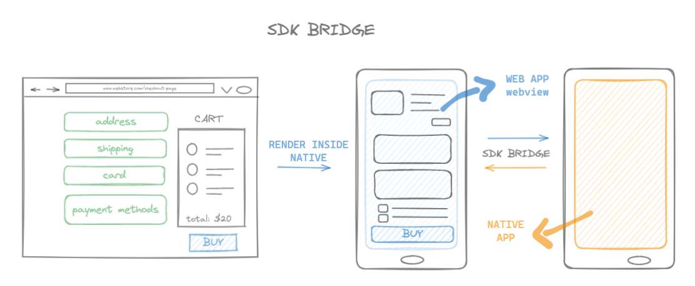
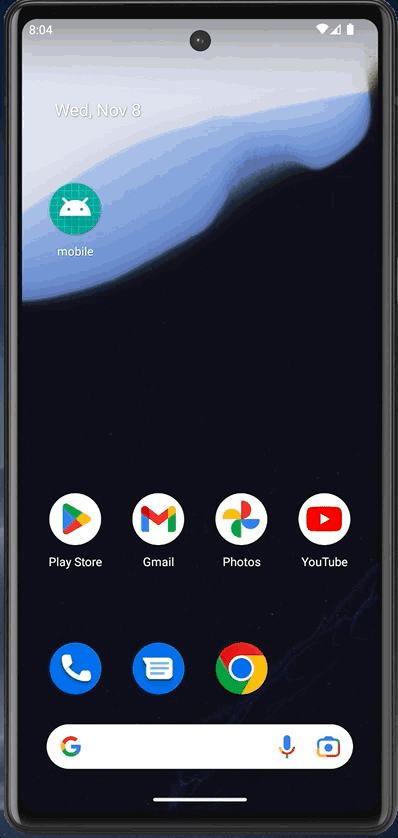
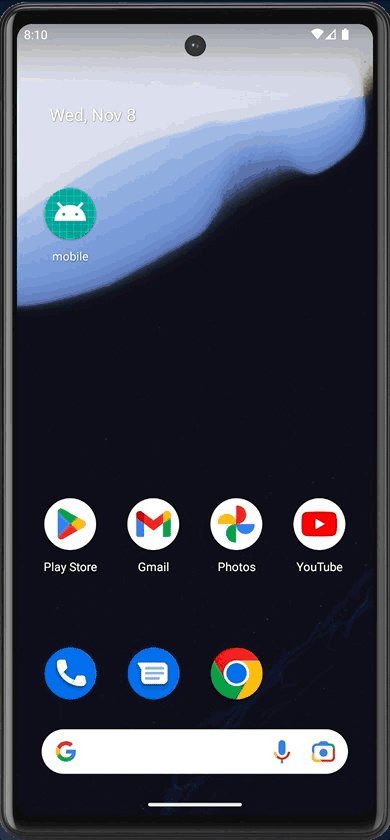

# SDK BRIDGE

<!-- Title -->

  

  <b>SDK Bridge implementation using React Native</b>
   

<!-- Body -->

### Getting Started

You have to run two different projects in order to see it running locally

- `mobile:`

  - `adb reverse tcp:5173 tcp:5173`: enable web-app port
  - `npx react-native run-android`: run native app inside android emulator

- `web:`

  - `yarn dev: ` will start a React web-app on [localhost:5173](http://localhost:5173/)

Once you're up and running you can play with it, here are some examples

| success                                                          | error (declined)                                                  |
| ---------------------------------------------------------------- | ----------------------------------------------------------------- |
|  |  |

### Features

- Communication between native-app (`inapp-sdk`) and webapp (`web-sdk`)
- Sample webstore to simulate purchase flow
- Simulated purchase authentication flow
- Expiration timer to simulate wait for user action
- State transition using XState (state machine)

### How it works

- Webstore was implemented on `native side` (green screens)
- Authentication flow was implemented on `web side` (pastel colors screens)
- When a user press the buy button, we load the web app inside `webview`
- From `web-sdk` we tell `inapp-sdk` to open/closes fullscreen mode

## Built With

- `web`

  - [Vite](https://vitejs.dev/) - Next Generation Frontend Tooling
  - [React.js](https://react.dev/)  - The library for web and native user interfaces
  - [XState](https://xstate.js.org/) - State machines and statecharts for the modern web.

- `mobile`

  - [React-Native](https://reactnative.dev/)  - Learn once, write everywhere
  - [React-Native-Webview](https://github.com/react-native-webview/react-native-webview) - React Native Cross-Platform WebView

## Author

- **Marcio Mendes** - [mmendesas](https://github.com/mmendesas)

## License

This project is licensed under the MIT License
